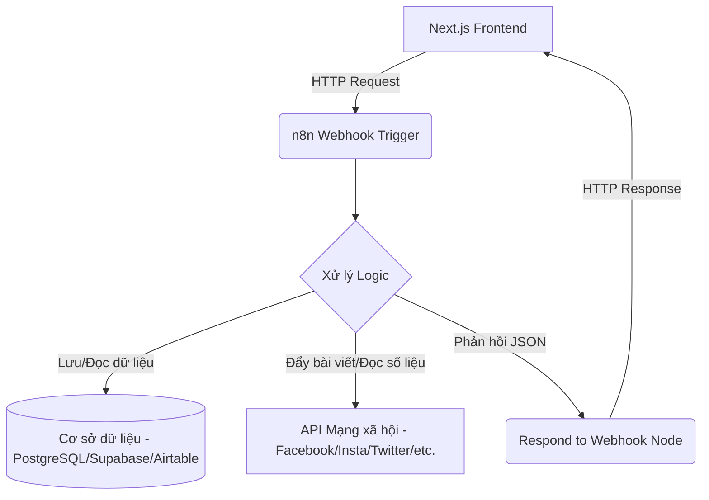

# 🔌 Hướng dẫn tích hợp n8n làm Backend cho Dashboard

Tài liệu này hướng dẫn cách kết nối giao diện Next.js của Dashboard với **n8n** (một công cụ tự động hóa quy trình mạnh mẽ) để đóng vai trò làm backend xử lý logic, quản lý cơ sở dữ liệu và tương tác với API của các mạng xã hội.

---

## 🗺️ Kiến trúc hệ thống (Architecture)

n8n sẽ đóng vai trò như một API Gateway và Logic Backend. Các yêu cầu từ Next.js sẽ được gửi tới các endpoint Webhook của n8n.



---

## 1. Thiết lập Workflow trên n8n

Mỗi endpoint API của dự án (ví dụ: `GET /posts`, `POST /posts`, `GET /customers`) sẽ tương ứng với một workflow trên n8n.

### Bước 1: Tạo Webhook Node (Trigger)
1. Thêm node **Webhook** vào workflow mới của bạn.
2. Cấu hình các thông số sau:
   - **Method**: Chọn phương thức phù hợp (`GET`, `POST`, `PATCH`, `DELETE`).
   - **Path**: Đặt đường dẫn tương ứng với API (Ví dụ: `posts` hoặc `customers`).
   - **Authentication**: 
     - Chọn `None` nếu muốn tự xử lý JWT token trong workflow.
     - Chọn `Header Auth` nếu muốn kiểm tra API Key trực tiếp tại node Webhook.
   - **CORS (Cross-Origin Resource Sharing)**: *Rất quan trọng để frontend gọi được API từ tên miền khác*. Bật cấu hình CORS trong phần Options của node Webhook và điền:
     - `Allowed Origins`: `*` hoặc địa chỉ frontend của bạn (ví dụ: `http://localhost:3000`).
     - `Allowed Headers`: `Content-Type, Authorization`.

### Bước 2: Xử lý dữ liệu (Database / Social Media API)
- **Truy vấn**: Sử dụng các node tương ứng như **PostgreSQL**, **Supabase**, **Airtable** hoặc các node mạng xã hội (**Facebook Graph API**, **Google Sheets**, v.v.) để lấy hoặc cập nhật dữ liệu dựa trên đầu vào từ Webhook (`query parameters` hoặc `body data`).

### Bước 3: Phản hồi kết quả (Respond to Webhook Node)
n8n cần trả về dữ liệu đúng định dạng JSON cho Next.js:
1. Thêm node **Respond to Webhook**.
2. Cấu hình:
   - **Respond With**: `Json`
   - **Response Body**: Định dạng dữ liệu theo cấu trúc chuẩn đã được định nghĩa trong api.md (ví dụ: `{ "success": true, "data": [...] }`).

> [!IMPORTANT]
> n8n có hai loại URL Webhook:
> - **Test Webhook URL**: Dùng khi bạn đang xây dựng/thử nghiệm (cần nhấn *Listen for test event* trong n8n).
> - **Production Webhook URL**: Dùng khi bạn kích hoạt (Active) workflow và chạy chính thức. Hãy chắc chắn sử dụng Production Webhook URL khi tích hợp thực tế.

---

## 2. Cấu hình Frontend Next.js

Để kết nối Next.js với n8n, chúng ta sẽ tạo một API Client dùng chung và cấu hình biến môi trường.

### Bước 1: Tạo tệp `.env.local`
Tạo tệp `.env.local` ở thư mục gốc của dự án (nếu chưa có) và trỏ Base URL đến n8n Webhook:

```env
# URL Webhook Production của n8n (bỏ phần path cuối, ví dụ /posts)
NEXT_PUBLIC_API_URL=https://your-n8n-instance.com/webhook
```

### Bước 2: Tạo API Client (`src/lib/apiClient.ts`)
Tạo một helper để gọi API dễ dàng, tự động gắn Token xác thực và xử lý lỗi:

```typescript
const BASE_URL = process.env.NEXT_PUBLIC_API_URL || "http://localhost:8000/v1";

export async function apiFetch<T>(
  endpoint: string,
  options: RequestInit = {}
): Promise<{ success: boolean; data?: T; error?: string }> {
  try {
    const token = localStorage.getItem("token"); // Lấy JWT token nếu có
    const headers = new Headers(options.headers);
    
    headers.set("Content-Type", "application/json");
    if (token) {
      headers.set("Authorization", `Bearer ${token}`);
    }

    const response = await fetch(`${BASE_URL}/${endpoint}`, {
      ...options,
      headers,
    });

    if (!response.ok) {
      const errorData = await response.json().catch(() => ({}));
      throw new Error(errorData.message || `Lỗi hệ thống: ${response.status}`);
    }

    const result = await response.json();
    return result;
  } catch (error: any) {
    console.error(`API Fetch Error [${endpoint}]:`, error);
    return { success: false, error: error.message || "Đã xảy ra lỗi kết nối" };
  }
}
```

---

## 3. Thay thế dữ liệu giả lập (Demo Data) bằng API n8n

Dưới đây là ví dụ minh họa cách thay thế dữ liệu cứng (`demoUsers`) trong phần Quản lý người dùng (`UsersSection.tsx`) bằng dữ liệu động tải từ n8n.

### Cải tiến `UsersSection.tsx`

```typescript
import { useState, useEffect } from "react";
import { apiFetch } from "@/lib/apiClient";
// ... (các import khác giữ nguyên)

type User = {
  id: string;
  name: string;
  role: "admin" | "editor" | "viewer";
  email: string;
  status: "active" | "invited" | "suspended";
};

export function UsersSection() {
  const [users, setUsers] = useState<User[]>([]);
  const [loading, setLoading] = useState(true);
  const [error, setError] = useState<string | null>(null);

  // Tải danh sách người dùng từ n8n
  const fetchUsers = async () => {
    setLoading(true);
    // Gửi yêu cầu GET đến n8n Webhook /users
    const result = await apiFetch<User[]>("users");
    
    if (result.success && result.data) {
      setUsers(result.data);
      setError(null);
    } else {
      setError(result.error || "Không thể tải danh sách người dùng");
    }
    setLoading(false);
  };

  useEffect(() => {
    fetchUsers();
  }, []);

  // Xử lý thêm người dùng (Gửi yêu cầu POST tới n8n)
  const handleAdd = async (newUserData: Omit<User, "id">) => {
    const result = await apiFetch<User>("users", {
      method: "POST",
      body: JSON.stringify(newUserData),
    });

    if (result.success && result.data) {
      setUsers(prev => [...prev, result.data!]);
    } else {
      alert(result.error || "Thêm người dùng thất bại");
    }
  };

  if (loading) return <div className="text-center py-4">Đang tải dữ liệu...</div>;
  if (error) return <div className="text-red-500 py-4">Lỗi: {error}</div>;

  return (
    // ... Phần JSX render giao diện giống như trước, sử dụng dữ liệu từ state `users`
  );
}
```

---

## 💡 Một số mẹo nhỏ & Kinh nghiệm tối ưu hóa
1. **Kiểm tra đầu vào (Validation)**: Ở n8n Webhook Node, bật tính năng `Always Respond` và thêm node **Switch** hoặc **If** để xác thực các tham số đầu vào. Tránh để workflow bị treo nếu Next.js truyền sai tham số.
2. **CORS trên Next.js (Dự phòng)**: Nếu n8n nằm sau một proxy chặn CORS và bạn không thể chỉnh cấu hình CORS trên n8n, hãy dùng tính năng **Rewrites** của Next.js trong `next.config.ts` để ủy quyền yêu cầu:
   ```typescript
   // next.config.ts
   import type { NextConfig } from "next";

   const nextConfig: NextConfig = {
     async rewrites() {
       return [
         {
           source: '/api/:path*',
           destination: 'https://your-n8n-instance.com/webhook/:path*',
         },
       ];
     },
   };
   export default nextConfig;
   ```
   Sau đó, trên Next.js chỉ cần gọi endpoint dạng `/api/users` thay vì địa chỉ tuyệt đối của n8n.
3. **Mã lỗi HTTP**: Hãy thiết lập node **Respond to Webhook** trả về mã HTTP thích hợp (ví dụ: `200 OK`, `201 Created` cho thêm mới, `400 Bad Request` cho lỗi đầu vào, hoặc `401 Unauthorized` cho sai thông tin đăng nhập).
